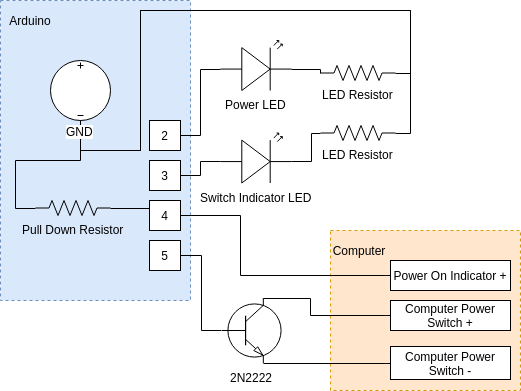

# Arduino PC/Computer Auto On Switch
## Description
Turn on PC, server, computer automatically using arduino without the need of pressing the power switch (such as in ATX power supply). Once the power source is connected, arduino will immediately press the switch.

It's best for computer without *"Turn on after AC power loss"* option in BIOS setting.

## Requirements
### Skill
It's recommended if you have a basic knowledge of electronic & computer parts to find the appropriate pin to connect to.

### Item Requirements

| Item                  | Amount    | Description                                                                                                                                 |
| --------------------- | --------- | ------------------------------------------------------------------------------------------------------------------------------------------- |
| 2N2222 NPN Transistor | 1         | Act as a switch to the power button                                                                                                         |
| Standard 5mm LED      | 2         | 2 different color of LED                                                                                                                    |
| LED Resistor          | 2         | May vary depending on the LED Color. for safe measure, use 330Ω resistor.                                                                   |
| Pull Down Resistor    | 1         | Use between 5kΩ to 10kΩ.                                                                                                                    |
| Arduino 5V            | 1         | Mostly compatible with Arduino using ATmega328. otherwise, configure the pin on your own. the current example is using Arduino Pro Mini 5V. |
| DC wires              | as needed | Between 24 to 28 AWG size is enough.                                                                                                        |
| Step Down Converter   | 1         | (Optional) If you want to get the power source from the higher DC Voltage.                                                                  |

## Assembly
Upload the code using Arduino-IDE, then before powering on, assemble the hardware following the schematic below.
then, connect power `5V +` power supply to `RAW` and `-` to `GND`

to ensure the 4th pin gets an indicator of *computer powered on state*, connect the pin to the power source 5V or below such as *power LED pin* etc. 

## Contribute
Feel free to make a pull request to improve the project.
